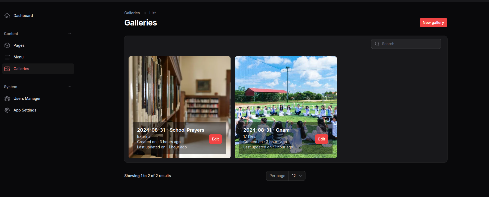
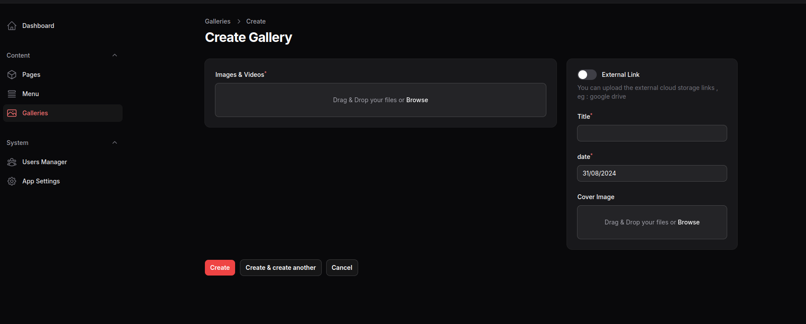
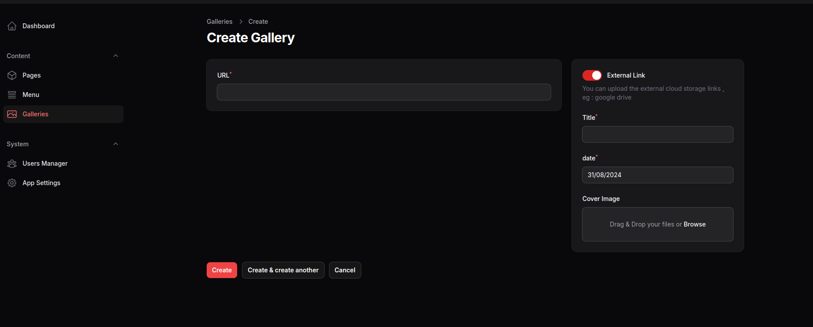

# Filament Gallery

Filament package for gallery

## Installation

Install Using Composer

```
composer require cwsps154/filament-gallery
```
Run

```
php artisan filament-gallery:install
```

## Usage/Examples

Add this into your Filament `PannelProvider` class `panel()`
```
$panel->plugins([FilamentGalleryPlugin::make()]);
```

You can limit the access to the resources
```
FilamentGalleryPlugin::make()
                        ->canViewAny('have-access', 'view-gallery')
                        ->canCreate('have-access', 'create-gallery')
                        ->canEdit('have-access', 'edit-gallery')
                        ->canDelete('have-access', 'delete-gallery'),

```

You can publish the config file `filament-gallery.php`, by running this command

```
php artisan vendor:publish --tag=filament-gallery-config
```

which contains these settings

```
return [
    'layout' => null,
    'cluster' => null,
    'navigation' => [
        'group' => 'filament-gallery::gallery.group',
        'label' => 'filament-gallery::gallery.gallery',
        'icon' => 'heroicon-o-photo',
        'sort' => 100,
    ]
];
```

## Screenshots






