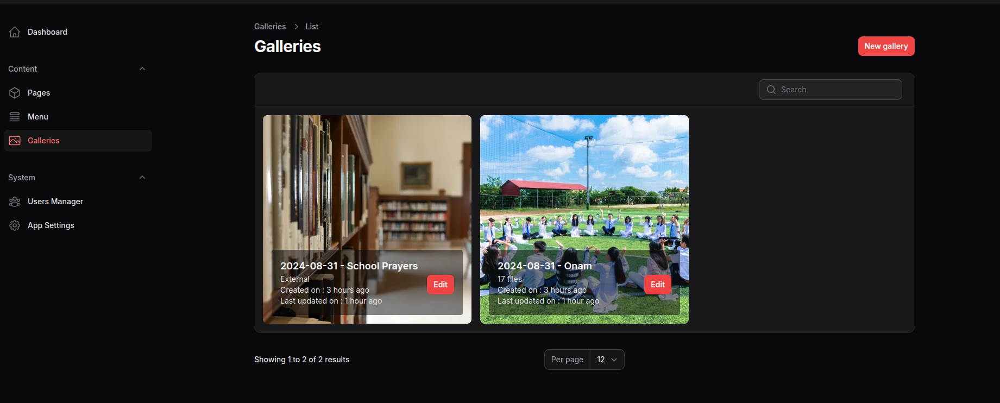
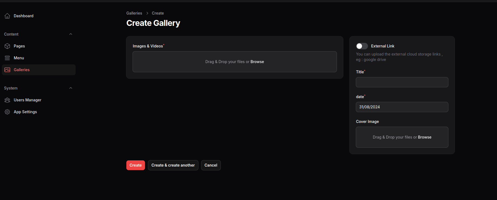
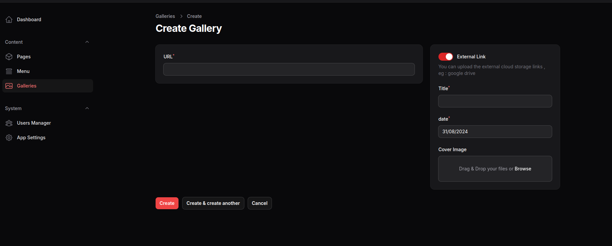

# MyGallery

Filament package for gallery

## Installation

Install Using Composer

```shell
composer require cwsps154/my-gallery
```
Run
```shell
php artisan my-gallery:install
```

## Usage/Examples

Add this into your Filament `PannelProvider` class `panel()`
```php
$panel->plugins([MyGalleryPlugin::make()]);
```

You can limit the access to the resources
```php
MyGalleryPlugin::make()
    ->canViewAny(function () {
        return true;
    })
    ->canCreate(function () {
        return true;
    })
    ->canEdit(function () {
        return true;
    })
    ->canDelete(function () {
        return true;
    })
```
If you are using `cwsps154/filament-users-roles-permissions` plugin you can use like this

```php
use CWSPS154\MyGallery\Models\Gallery;

MyGalleryPlugin::make()
    ->canViewAny('have-access', Gallery::VIEW_GALLERY)
    ->canCreate('have-access', Gallery::CREATE_GALLERY)
    ->canEdit('have-access', Gallery::EDIT_GALLERY)
    ->canDelete('have-access', Gallery::DELETE_GALLERY),
```

You can publish the config file `my-gallery.php`, by running this command

```shell
php artisan vendor:publish --tag=my-gallery-config
```

which contains these settings

```php
return [
    'settings-page' => \CWSPS154\AppSettings\Page\AppSettings::class,
];
```
You have to run queue in your local to see the saved gallery
```shell
php artisan queue:work
```
Set the cron in server for the same

## Screenshots






